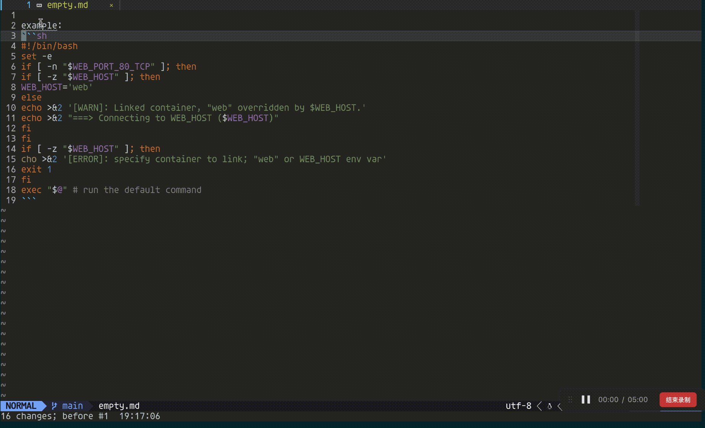

# markdown-codeblock-format.nvim

A simple plugin to format selected code block in markdown file based on conform.nvim.

# How to use it ?

1.Make sure that you select code block \```{lang}\n{your code}\``` in  v model

2.Then press `<leader>fm` to call the lua function to format the code




# Setup

1.You need to setup some formatters by language.

It support all formatters that can be used with `conform.nvim` becuase the format function is just a invoking of  

```lua 
require("turato.mcf").setup({
	formatters = {
		sh = { "shfmt" },
        -- language = { formatter1, formatter2,... }
	},
})
```

2.Set key mapping for formatting code block.

```lua 
vim.api.nvim_set_keymap(
    "v",
    "<leader>fm",
    ':lua require("turato.mcf").format_selected_code()<CR>',
    { noremap = true, silent = true }
)
```


# Installation

<details>
  <summary>lazy.nvim</summary>

```lua
return {
	"hustuhao/markdown-codeblock-format.nvim",
	dependencies = {
		"stevearc/conform.nvim",
	},
	config = function()
		local opts = {
			-- Define the formatters to use for each language
			formatters = {
				lua = { "stylua" },
				python = { "black" },
				javascript = { "prettier" },
				sh = { "shfmt" },
				sql = { "sqlfmt" },
				go = { "goimports", "gofmt" },
				rust = { "rustfmt" },
			},
		}

		require("turato.mcf").setup(opts)
	end,

	keys = {
		-- Define key mappings using the 'keys' configuration in LazyVim
		{
			"<leader>fm",
			':lua require("turato.mcf").format_selected_code()<CR>',
			mode = "v", -- Visual mode
			noremap = true,
			silent = true,
			desc = "Format selected code block", -- Description for the key mapping
		},
	},
}
```
</details>


<details>
  <summary>Packer</summary>

```lua
return require("packer").startup(function()
	use({
		"hustuhao/markdown-codeblock-format.nvim",
		config = function()
			local opts = {
				-- Define the formatters to use for each language
				formatters = {
					lua = { "stylua" },
					python = { "black" },
					javascript = { "prettier" },
					sh = { "shfmt" },
					sql = { "sqlfmt" },
					go = { "goimports", "gofmt" },
					rust = { "rustfmt" },
				},
			}
			require("turato.mcf").setup(opts)
		end,
	})

	-- Key mapping
	vim.api.nvim_set_keymap(
		"v",
		"<leader>fm",
		':lua require("turato.mcf").format_selected_code()<CR>',
		{ noremap = true, silent = true }
	)
end)
```
</details>

